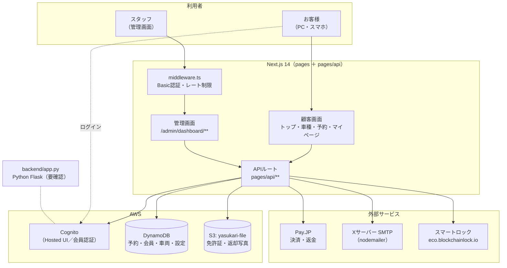
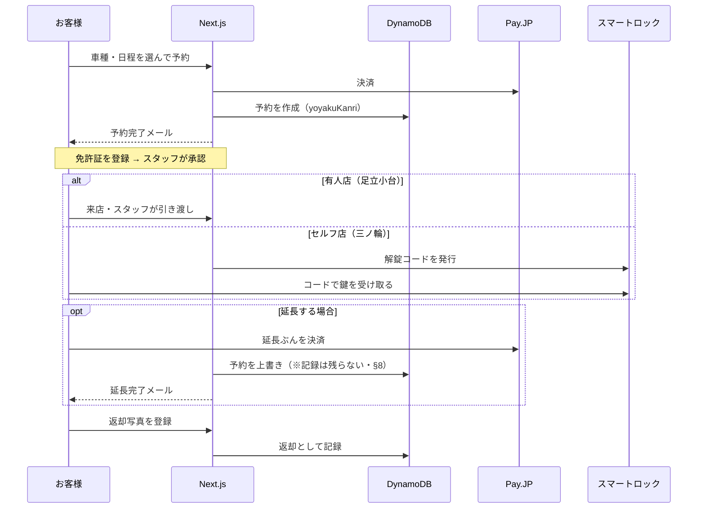

# ヤスカリ 予約サイト システム構成・仕様概要

- 対象：**本番稼働中の予約サイト**（`yasukari.com`）
- 作成日：2026-09-17
- 出典：**本番コードを直接確認して作成**。既存資料（`docs/引き継ぎ_ヤスカリ予約サイト_エンジニア向け.md` ほか）と
  食い違う点は、コード側の現状を正とした。
- **「要確認」と書いた項目は、コードからは判断できずAWSコンソール等での確認が要るもの。**

---

## 1. 全体構成

**要点**

- **画面もAPIも1つの Next.js アプリの中にある**（`pages/` と `pages/api/`）。分離したバックエンドは無い。
- `backend/app.py`（Python Flask・456行）が残っているが、**Next.js 側からの参照は無い。**
  稼働しているかどうかは**要確認**。
- **`middleware.ts` は `/api` を対象外にしている**（`matcher: ['/((?!api|wait).*)']`）。
  → 画面はBasic認証で守られるが、**APIは middleware を通らない**。各APIが自前で認証するかどうか次第。

---

## 2. 技術スタック

| レイヤ | 使っているもの | 補足 |
|---|---|---|
| フロント／API | **Next.js 14.1**（Pages Router）／React 18／TypeScript | `app/` は `layout.tsx` のみでほぼ未使用 |
| スタイル | Tailwind CSS ／ 一部 `styles/*.css` | |
| 会員認証 | **AWS Cognito（Hosted UI）** | 詳細は §5 |
| データ | **DynamoDB** | 予約は**全件スキャン**で読んでいる（§4） |
| ファイル | **S3（`yasukari-file`）** | 免許証・返却写真・事故報告写真 |
| 決済 | **Pay.JP** | `lib/payjp*.ts` |
| メール送信 | **nodemailer（SMTP）** | `@aws-sdk/client-ses` も依存にあるが、実送信はSMTP |
| 物理鍵 | スマートロック（`eco.blockchainlock.io`） | セルフ店のキーボックス |
| テスト | Jest（`__tests__/`） | |
| ホスティング | **要確認**（ドメインは AWS 管理） | リポジトリに Amplify 等の設定ファイルは無い |

---

## 3. 画面一覧

### 顧客向け（主なもの）

| 区分 | 画面 |
|---|---|
| トップ・案内 | `/` ／ `/guide` ／ `/beginner` ／ `/help` ／ `/pricing` ／ `/options` ／ `/insurance` ／ `/company` ／ `/stores` |
| 車種 | `/products` ／ `/products/[modelCode]` |
| 予約 | `/reserve/**` ／ `/payment-info/complete` |
| **マイページ** | `/mypage` ／ `/mypage/past-reservations` ／ `/mypage/rentals/[予約ID]` ／ **`/mypage/rentals/extend/**`（延長）** ／ `/mypage/profile-setup` ／ `/mypage/registration` |
| 認証 | `/login` ／ `/signup` ／ `/auth/callback` ／ `/auth/logout` ／ `/register/**` |
| 契約・状況 | `/rental-contract/[予約ID]` ／ `/rental-status` |
| 読み物 | `/news/**` ／ `/blog_for_custmor/**` ／ `/rental_bike/**` |
| 規約類 | `/terms` ／ `/privacy` ／ `/tokusyouhou` ／ `/rental-bike-terms` |
| その他 | `/chat`（チャットボット）／ `/contact` ／ `/notifications` ／ `/maintenance` ／ `/wait` |
| 英語版 | `/en/**`（マイページ・登録・過去予約など） |

### 管理画面（`/admin/dashboard/**`・Basic認証の内側）

| 区分 | 画面 |
|---|---|
| 予約 | `reservations` ／ `reservations/[予約ID]` ／ `approvals` |
| 車両 | `vehicles` ／ `vehicles/[管理番号]` ／ `vehicles/register` ／ `bike/index` ／ `bike-schedules/**` |
| 車種・料金 | `bike-models/**` ／ `bike-classes/**` ／ `bike-models/[id]/rental-pricing` ／ `bike-classes/[id]/monthly-pricing` ／ `coupon-rules/**` ／ `high-season-manager` |
| 会員 | `members` ／ `members/[id]` |
| 写真・書類 | `photo-uploads/**`（免許証・返却写真・事故報告） |
| 鍵 | `keybox-issue` ／ `keybox-reissue` ／ `keybox-logs` |
| 連絡 | `broadcast`（一斉配信）／ `newsletter-settings` ／ `rental-reminders` ／ `mail-history` ／ `test-mail` ／ `announcements` |
| チャットボット | `chatbot/faq` ／ `chatbot/inquiries/**` |
| その他 | `analytics/**` ／ `accessories/**` ／ `holiday-manager/**` ／ `blog/**` ／ `site-visibility` |

---

## 4. データの置き場所

### DynamoDB（環境変数でテーブル名を切り替え。かっこ内は既定値）

| 用途 | 環境変数（既定値） |
|---|---|
| **予約** | `RESERVATIONS_TABLE`（`yoyakuKanri`） |
| **会員** | `USER_TABLE`（`yasukariUserMain`） |
| 仮登録 | `REGISTRATION_TABLE` |
| 車両 | `VEHICLES_TABLE`（`Vehicles`） |
| 車種 | `BIKE_MODELS_TABLE`（`BikeModels`） |
| クラス | `BIKE_CLASSES_TABLE`（`BikeClasses`） |
| 料金 | `VEHICLE_RENTAL_PRICES_TABLE` |
| 画面の設定類 | `SETTINGS_TABLE` |
| メール送信履歴 | `MAIL_HISTORY_TABLE_NAME`（`usermailHistory`） |
| 通知 | `USER_NOTIFICATIONS_TABLE`（`UserNotifications`） |
| 鍵の操作ログ | `KEYBOX_LOG_TABLE`（`keyboxExecutionLogs`） |

**注意：予約の読み出しは `Scan`（全件走査）**。`lib/reservations.ts` の
`fetchAllReservations` / `fetchReservationsByMember` は、**毎回テーブル全体を読んで JS 側で絞り込んでいる**。
件数が増えるほど遅くなり、読み取り課金も増える。インデックス（GSI）を使った検索に変えるのが将来課題。

### S3

- バケット **`yasukari-file`**：免許証画像・返却写真・事故報告写真
- **公開設定は要確認**（引き継ぎ資料で最優先の指摘事項になっている）

### 設定の保存

- `lib/server/settingsStore.ts` … **本番は DynamoDB、ローカルは `data/*.json`**。
  お知らせバナー・FAQ・メルマガ設定・メンテ表示などが対象。デプロイで消えない作りになっている。
- 店舗マスタは **`lib/stores.ts` の `STORES`**（唯一の出所）。
  `id` は予約の `storeName` と同じ文字列（`"足立小台店"` / `"三ノ輪店"`）。

---

## 5. 認証

### 会員（お客様）

**AWS Cognito の Hosted UI** にリダイレクトして認証する。

1. `/api/login` が `buildAuthorizeUrl()` で Cognito の認可URLを作る（`lib/cognitoHostedUi.ts`）
2. Cognito で認証 → `/auth/callback` に戻る
3. コールバックがURLの `#` からトークンを取り出し、`/api/auth/store-tokens` が **HttpOnly Cookie** に入れる
4. 以降 `/api/me` が `lib/cognitoServer.ts` の `verifyCognitoIdToken()` で検証する

**Cookie**：`cognito_id_token` ／ `cognito_access_token`（`HttpOnly; SameSite=Lax; Secure`）

> **既知の問題**：ログインの入口が `response_type=token`（インプリシット・フロー）のため、
> **リフレッシュトークンが発行されない**（リポジトリに `refresh_token` の記述が皆無）。
> Cookie の寿命は `expires_in`＝**既定1時間**で、切れたら更新する手段が無い。
> → **1時間でログアウトする。** 直すには認可コード＋PKCE への移行が要る。
> ※ 新規登録の入口（`buildSignupUrl`）は既に `response_type=code`。入口によってフローが違う。

### 管理画面（スタッフ）

- `middleware.ts` の **Basic認証**＋レート制限。
- **`/api` は middleware の対象外**（`matcher: ['/((?!api|wait).*)']`）。
  管理APIが自前で認証しているかは、APIごとに確認が要る。

---

## 6. API 一覧（`pages/api/**`）

| 区分 | エンドポイント |
|---|---|
| 認証 | `login` ／ `logout` ／ `me` ／ `auth/store-tokens` ／ `signup` |
| 会員登録 | `register/temporary` ／ `register/verify` ／ `register/user` ／ `register/store-user` ／ `register/license-uploads` ／ `register/reservation/[予約ID]` |
| 会員情報 | `user/attributes` ／ `user/rental-terms` |
| **予約** | `reservations`（一覧・作成）／ `reservations/[予約ID]`（取得・**PATCH更新**）／ `reservations/me` ／ **`reservations/extension/notify`（延長完了メール）** |
| 決済 | `payments/payjp` ／ `payments/payjp-refund` ／ `payments/payjp/refund` |
| 車両・料金 | `vehicles` ／ `vehicles/[管理番号]` ／ `vehicles/auto-availability` ／ `bike-models` ／ `bike-classes` ／ `vehicle-rental-prices` ／ `accessories` ／ `coupon-rules` ／ `high-season/**` ／ `calendar/**` |
| 返却・事故 | `return-report` ／ `accident-report` |
| 通知 | `notifications` ／ `notifications/overdue-return` ／ `announcement-banner` |
| チャットボット | `chatbot/faq` ／ `chatbot/messages` ／ `chatbot/inquiries/**` |
| 管理 | `admin/**`（会員・鍵・メール・写真・返却承認・一斉配信・リマインド 等） |
| 運用 | `maintenance` ／ `monitor` ／ `unblock` ／ `contact` |

---

## 7. 主要な業務の流れ

---

## 8. いま分かっている弱点（共有先に必ず伝えること）

| # | 内容 | 影響 | 記録 |
|---|---|---|---|
| 1 | **ログインが1時間で切れる**（インプリシット・フローでリフレッシュトークンが無い） | 利用中に突然ログアウトする | `docs/本番不具合_延長記録とログイン_調査.md` |
| 2 | **延長の記録が残らない。** 予約を上書きするだけ。`paymentId` が延長の課金IDで上書きされ、元の課金IDが失われる | 返金・領収書の突き合わせができない。マイページの金額と支払日が食い違う | `docs/課題_延長記録が残らない.md` |
| 3 | **予約の更新で `parking_number`（駐車位置）が消える。** `PutCommand` で全置換しているが、書き戻さないキーがある | セルフ店の受け取り案内に影響 | 同上 |
| 4 | **`middleware.ts` が `/api` を対象外**にしている | APIごとに自前で認証していないと、無認証で叩ける | `docs/引き継ぎ_ヤスカリ予約サイト_エンジニア向け.md` |
| 5 | **予約の読み出しが全件スキャン** | 件数増で遅くなる・読み取り課金が増える | 本資料 §4 |
| 6 | `package.json` に **`nodemailer` が2回書かれている** | すぐの実害は無いが、`npm ci` が通らない原因になりうる | 本資料 |
| 7 | S3 バケットの公開設定が**未確認** | 免許証画像の露出リスク | `docs/引き継ぎ_…` |

**1〜3 は記録済みで未対応。** 着手の順番は `docs/本番不具合_延長記録とログイン_調査.md` に整理してある。

---

## 9. 作り直し中の新システムについて

- 別リポジトリ **`YASUKARI`** の `starter/`（Next.js・静的書き出し）で、
  **管理画面を一から作り直している**（ブランチ `claude/design-m3-v2`）。
- 方針：**デモをそのまま本番へ昇格させる**（2026-08-18 社長決定）＝ `starter/` が将来の本番コード。
- 現行本番の弱点は、新システム側の決め事として申し送り済み
  （例：**延長は「記録」として1回1行で持つ** → `docs/未確定事項_一覧.md` A-31）。
- 主な設計資料：`docs/新システム_決定事項まとめ.md` ／ `docs/新システム_P0決定表.md` ／
  `docs/データモデル_紐づき設計_v2.1.md` ／ `docs/新システム_DB管理要件.md` ／
  `docs/ヤスカリ業務一覧.md`（**自動生成**。手で編集しない）

---

## 10. この資料の限界

コードから読み取れたことだけを書いている。次は**コードの外**なので確認が要る。

- ホスティング先とデプロイ手順（Amplify／EC2 など）
- `backend/app.py`（Flask）が稼働しているかどうか
- S3 バケットの公開設定
- Cognito ユーザープールの設定（トークン有効期限・属性・IdP）
- 各種APIキーの管理場所
